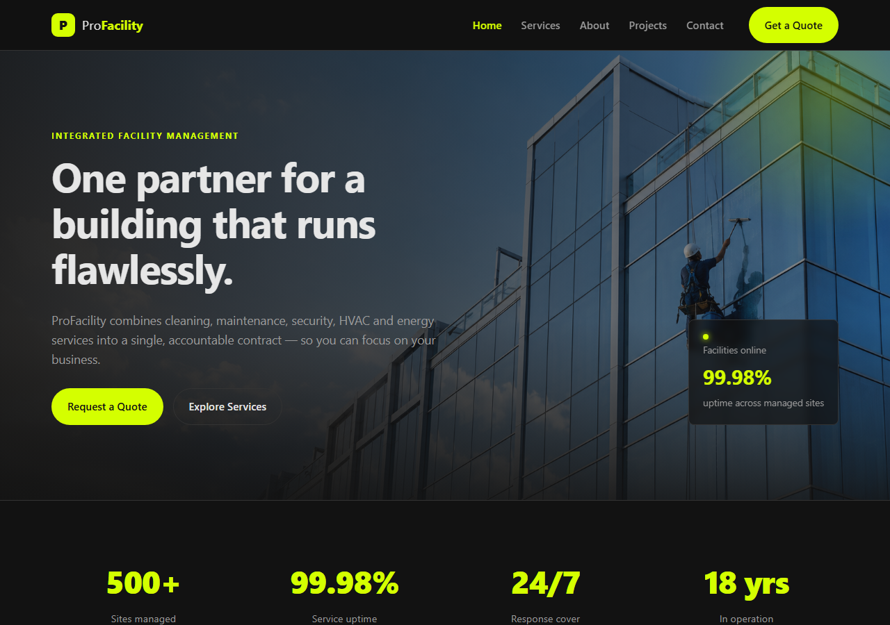

# ProFacility — Facility Management Website

A modern, responsive website for an integrated facility management company, built with
**Nuxt 3 (Vue 3)**. Dark-gray theme with a fluorescent-yellow accent.



---

## ✨ Features
- ⚡ **Nuxt 3 + Vue 3** with file-based routing and auto-imported components
- 🎨 Custom design system — **gray base + fluorescent-yellow accent** (`#d4ff00`)
- 🖼️ Full-width hero with background image and sticky header
- 📱 Fully responsive (mobile menu, fluid grids)
- 🧩 Reusable components (header, footer, hero, service cards, stats, CTA)
- 📝 Working contact form with client-side validation
- 🗂️ Local data composable (`useServices`) — no backend required

## 📄 Pages
| Route | Description |
|-------|-------------|
| `/` | Home — hero, stats, featured services, how-it-works, CTA |
| `/services` | Full grid of services |
| `/about` | Company story, mission, values |
| `/projects` | Portfolio & industries served |
| `/contact` | Contact form + company details |

## 🛠️ Tech Stack
- [Nuxt 3](https://nuxt.com) / [Vue 3](https://vuejs.org)
- Plain CSS design system (no UI framework)
- Node.js 18+ / npm

---

## 🚀 Getting Started

```bash
# clone
git clone https://github.com/jasna18/facility-management.git
cd facility-management/frontend

# install dependencies
npm install

# start dev server → http://localhost:3000
npm run dev
```

### Build for production
```bash
npm run build      # server build → .output/
npm run preview    # preview the production build
npm run generate   # static site → for static hosting
```

---

## 📁 Project Structure
```
.
├── frontend/                 # Nuxt 3 application
│   ├── assets/css/main.css   # design system (gray + fluorescent yellow)
│   ├── assets/images/        # build-processed images
│   ├── components/           # AppHeader, AppFooter, HeroSection, ServiceCard…
│   ├── composables/          # useServices (local data)
│   ├── layouts/              # default layout
│   ├── pages/                # index, services, about, projects, contact
│   ├── public/images/        # static images (hero.png, etc.)
│   └── nuxt.config.ts
├── docs/                      # screenshots
├── task.md                   # build plan & progress
├── next.md                   # roadmap / next steps
└── generate-syntax-doc.mjs   # generates a PDF of the full source
```

## 🎨 Color Theme
| Token | Value | Use |
|-------|-------|-----|
| `--bg` | `#121212` | Page background |
| `--surface` | `#1e1e1e` | Cards / sections |
| `--text` | `#e6e6e6` | Primary text |
| `--muted` | `#9a9a9a` | Secondary text |
| `--accent` | `#d4ff00` | Fluorescent yellow accent |

---

## 🗺️ Roadmap
See [next.md](next.md) for planned features (pricing page, careers, blog, CMS, deployment).

## 📦 Source Reference
A full PDF of every source file can be regenerated with:
```bash
node generate-syntax-doc.mjs   # → syntax-reference.html (print to PDF)
```

---

_Built with [Nuxt 3](https://nuxt.com)._
